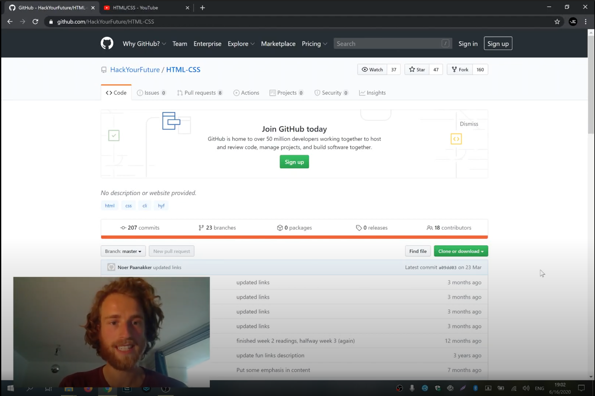

> If you are following the HackYourFuture curriculum we recommend you to first take a look at the complete curriculum, which you can find [here](https://github.com/HackYourFuture/curriculum).

> Please help us improve and share your feedback! If you find better tutorials or links, please share them by [opening a pull request](https://github.com/HackYourFuture/HTML-CSS/pulls).

# Module #1 - HTML, CSS and GIT (Frontend)

Welcome to the wonderful world of web development! In this module you will learn the basic building blocks of the web: HTML and CSS. HTML gives us the power to add text, images and videos to a page. CSS gives us the power to organize these parts and make it look nice.

The products of HTML and CSS comprise a two-thirds of what is called `frontend` (the final third is client-side JavaScript, which you will learn about in later modules). What is frontend? It's another word for the presentational part of a piece of software. In terms of web development we're talking about "what you see" when you go to any website.

Think of it like this: if a webpage were a person, the HTML would be the skeleton and CSS the skin and clothing!

You'll also be learning [GIT](https://www.youtube.com/watch?v=P0kF3vvy3QM), software that will allow you to save your folders and files in case they accidentally get deleted or end up corrupt. It can do much more and you'll learn all about that starting from week 2!

## Learning goals

In order to successfully complete this module you will need to master the following:

- Be able to write syntactically correct `HTML` and `CSS`
- Understand what is meant by `responsive` web development
- Practice navigating your computer using the `command line interface (CLI)`
- Learn about `GIT` and its basic usage
- Become familiar with `Trello` and `GitHub` as a way to submit your homework
- Know your way around `Visual Studio Code`
- Feel comfortable working with your `browser's inspector`

## How to use this repository

> Before you do anything, first go [here](Week0/README.md).

### Repository content

This repository consists of 3 essential parts:

1. `README`: this document contains all the required theory you need to understand **while** working on the homework. It contains not only the right resources to learn about the concepts, but also lectures done by HackYourFuture teachers. This is the **first thing** you should start with every week
2. `MAKEME`: this document contains the instructions for each week's homework. Start with the exercises rather quickly, so that you can ground the concepts you read about earlier.
3. `LESSONPLAN`: this document is meant for teachers as a reference. However, as a student don't be shy to take a look at it as well!

### How to study

Let's say you are just starting out with HackYourFuture. This is what you do...

1. The week always starts on **Wednesday**. First thing you'll do is open the `README.md` for that week. For the first week of `HTML-CSS`, that would be [Week1 Reading](/Week1/README.md)
2. You spend **Wednesday** and **Thursday** going over the resources and try to get a basic understanding of the concepts. From the second week on, you'll also implement any feedback you got on last week's homework
3. On **Friday** you start with the homework, found in the `MAKEME.md`. For the first week of `HTML-CSS`, that would be [Week1 Homework](/Week1/MAKEME.md)
4. You spend **Friday** and **Saturday** playing around with the exercises and write down any questions you might have
5. **DEADLINE 1**: You'll submit any questions you might have before **Saturday 23.59**, in the class channel
6. On **Sunday** you'll attend class. It'll be of the Q&A format, meaning that there will be no new material. Instead your questions shall be discussed and you can learn from others
7. You spend **Monday** and **Tuesday** finalizing your homework
8. **DEADLINE 2**: You submit your homework to the right channels (Trello/GitHub) before **Tuesday 23.59**. If you can't make it on time, please communicate it with your mentor
9. Start the new week by going back to point 1!

In summary:

To have a more detailed overview of the guidelines, please read [this document](https://docs.google.com/document/d/1JUaEbxMQTyljAPFsWIbbLwwvvIXZ0VCHmCCN8RaeVIc/edit?usp=sharing) or ask your mentor/class on Slack!

### Video lectures

For each module HackYourFuture provides you with video lectures. These are made by experienced software developers who know what they're talking about. The main teacher for this module will be [Arco Mul](https://hackyourfuture.slack.com/team/UBVNH7CG1): an experienced video game and web developer!

You can find out more about him here:

- [Personal website](https://www.arcomul.nl/)
- [GitHub](https://github.com/ArcoMul)
- [@Arco on Slack](https://hackyourfuture.slack.com/team/UBVNH7CG1)

Learn from Arco in the following playlist of videos he has made for you! (Click on the image to open the link)

## Planning

| Week | Topic                                                  | Reading Materials              | Homework                        | Lesson Plan                            |
| ---- | ------------------------------------------------------ | ------------------------------ | ------------------------------- | -------------------------------------- |
| 0.   | Quick Start!                                           | [W0 Reading](Week0/README.md)  | -                               | -                                      |
| 1.   | Command Line Interface basics, HTML/CSS syntax         | [W1 Reading](/Week1/README.md) | [W1 Homework](/Week1/MAKEME.md) | [W1 Lesson Plan](/Week1/LESSONPLAN.md) |
| 2.   | Introduction to GIT, Responsive design                 | [W2 Reading](/Week2/README.md) | [W2 Homework](/Week2/MAKEME.md) | [W2 Lesson Plan](/Week2/LESSONPLAN.md) |
| 3.   | GIT branches, CSS frameworks, Working with the browser | [W3 Reading](/Week3/README.md) | [W3 Homework](/Week3/MAKEME.md) | [W3 Lesson Plan](/Week3/LESSONPLAN.md) |

## Finished?

Have you finished the module? Great! Pat yourself on the back for the great work you've done.

If you feel ready for the next challenge, click [here](https://www.github.com/hackyourfuture/javascript1) to go to **JavaScript1**!

_The HackYourFuture curriculum is subject to CC BY copyright. This means you can freely use our materials, but just make sure to give us credit for it :)_
