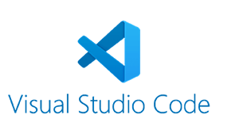

# Welcome to HackYourFuture!

Hi new student, welcome to HackYourFuture! In this document you'll find all the instructions you need in order to prepare yourself for your journey in HackYourFuture, and beyond!

## Agenda

We'll discuss the following points:

- How do I communicate with everybody? Use communication tool [Slack](https://www.slack.com)
- Where do I write my code? Inside a code editor called [Visual Studio Code](https://code.visualstudio.com/)
- What's the way to submit my homework? Use planning tool [Trello](https://trello.com/)
- How do I put my code online? On software development platform [GitHub](https://www.github.com/)

### How do I communicate with everybody? Use Slack


Slack is an application that allows us to communicate with others through (video) chat. It's used in most tech companies and is really easy to use. In order for you to get familiar we're going to use it as well!

Have a look at this

Please download the app for on your desktop:

- [macOS](https://slack.com/downloads/mac) 
- [Windows](https://slack.com/downloads/windows)
- [Linux](https://slack.com/downloads/linux)

And if you really can't go without your phone, you can also get it for mobile:

- [App store](https://itunes.apple.com/nl/app/slack/id803453959?mt=12)
- [Google Play](https://play.google.com/store/apps/details?id=com.Slack&hl=nl)

When it's all installed it's time to get into it! First try out the demo:

- [Slack Demo](https://slackdemo.com/)

Important things to note is to:

- make use of threads to isolate discussions
- format code to make it easier to read by using the ` ``` your code ``` ` syntax

These are the first things to do once you have been invited into slack:

- Add a (professional looking) profile picture
- Add a nice description about yourself
- Say hi to your classmates in the class channel

Done? This is optional, but for those who are curious:

- [Cheat sheet for basics and shortcuts](https://slack.com/intl/en-nl/help/articles/201374536-Slack-keyboard-shortcuts)
- [How to format your messages in Slack](https://api.slack.com/reference/surfaces/formatting)

### Where do I write my code? Inside a code editor called Visual Studio Code



Technically speaking, you can write code for the web in any application that allows you to write and save plain text files (such as Notepad or TextEdit). However a code editor is a tool specifically designed for editing code.

Depending on the programming language, the code editor highlights special keywords, gives suggestions to some extent, adds automatic indentation and sometimes has an integrated command line interface (more on that in the next section) as well.

While your code editor does the basic job of allowing you to write code, it can always be improved to make our lives as developers easier. In [this video](https://www.youtube.com/watch?v=ORrELERGIHs&t=324s) you'll get a great introduction on all the features. His code is python, so don't worry about understanding the code, it is about how to navigate the visual studio code environment.

Currently, Visual Studio Code is one of the top code editors on the market. As such, we have chosen it has our default code editor to use. Click the following link to download it:

- [Visual Studio Code](https://code.visualstudio.com/)

#### Improving our code editor

We can always improve what we have, including our code editor! We can add `extensions` to make our programming life much easier. Please install the following extensions as well and see for yourself!

- [Live Server](https://marketplace.visualstudio.com/items?itemName=ritwickdey.LiveServer)
- [Prettier](https://marketplace.visualstudio.com/items?itemName=esbenp.prettier-vscode) (Make sure to enable 'Format on save' in the Visual Studio Code settings after installing this plugin)

For more specific information on how to setup your editor:

- [VSCode Tips](https://github.com/HackYourFuture/fundamentals/tree/master/VSCodeTips)

### What's the way to submit my homework? Use planning tool Trello

<br/>
<a href="http://www.youtube.com/watch?feature=player_embedded&v=tVooja0Ta5I" target="_blank"></a><br/>

Trello is a planning tool that allows you to make todo lists in order to organize and prioritize your projects. In HackYourFuture we'll use it to submit your homework for the first module. Before you start your first class, please do the following:

- [Register](https://trello.com/signup) for an account
- Get access to the `Feedback Assignments` board, by asking @Wouter in Slack
- Create a card with your name. Inside, add a CodePen URL of your technical assignment + a short description of your website

### How do I put my code online? On software development platform GitHub

<a href="http://www.youtube.com/watch?feature=player_embedded&v=w3jLJU7DT5E" target="_blank"></a>

GitHub is a place where you can put your code online. Why? To safely store your code in case something bad happens to your computer (computer crash, virus, faulty files). You'll always be able to access this code from GitHub, using any other computer.

- [Register](https://github.com/join) for an account
- Put the URL for your account in the class channel

### Check double check

Let's make sure you have done everything necessary:

- Slack: downloaded, added profile and said hi
- Visual Studio Code: downloaded, added plugins
- Trello: registered and added a card, including the CodePen URL of your technical assignment + short description
- Github: registered and put the URL of your account in the class channel

> If the answer to this is 'no', don't panic. First try and see if you can find some information about the above tools yourself (hint: ask Google first). If that doesn't work, don't be shy to ask your classmates or anyone from HackYourFuture on what to do next.

### Finished?

Have you finished with everything? Be proud of yourself, as you have optimally prepared yourself with all the tools needed to make your coding adventure a success!

Before getting technical, please read about the HackYourFuture culture [here](https://github.com/HackYourFuture/culture) and also check [these scenarios](https://github.com/HackYourFuture/culture/blob/main/scenarios.md) that will give you a hint on how we work. The first or second week of the course, there will be a collaborative session with your whole class to discuss all of this.

Now, with that out of the way we can get started with the readings for the first week. You can find that [here](https://github.com/HackYourFuture/HTML-CSS/blob/master/Week1/README.md). Make sure you've finished it before your first class on Sunday!
