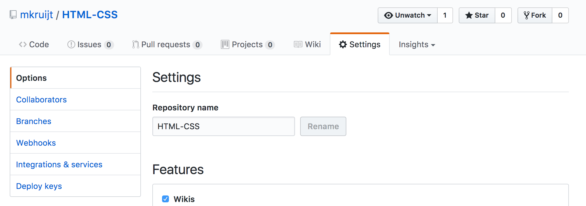
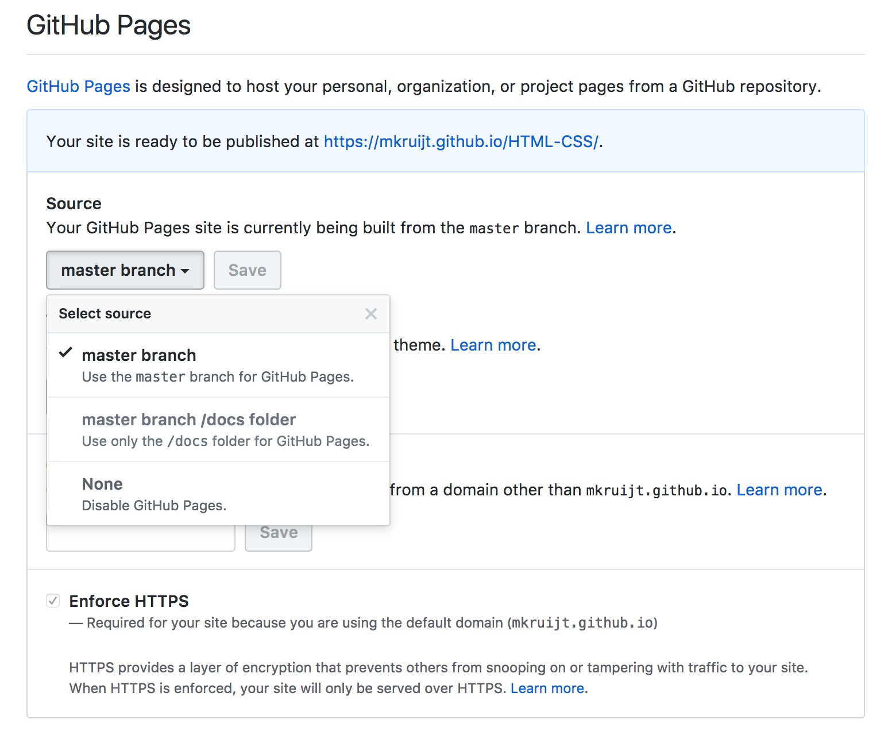

## Homework Week 1

>[Here](/Week1/README.md) you find the readings you have to complete before the second lecture.

### Learning goals for this week:
```
 • The division of labor between HTML and CSS
 • Introduction to HTML:
    • Parents, children, attributes
    • Indentation
    • Semantic elements
    • Paragraphs, links, images, lists
 • Introduction to ARIA:
    • What is ARIA and why is it important?
    • Using ARIA in HTML
    • Validating ARIA
 • Introduction to CSS:
    • Where can we write it and what difference does that make?
    • Selectors (id, class, element type), properties
    • How to structure a CSS file
    • Naming things
 • External files: relative and absolute paths
 • Getting to know your text editor
```

## Step 1: Read and watch
#### Good learning practices
Before you start check out this [video](http://www.learningscientists.org/videos/) and/or this [article](https://www.cultofpedagogy.com/learning-strategies/) about good learning practices.

#### HTML5
- Read about [HTML5](https://developer.mozilla.org/en-US/docs/Web/Guide/HTML/HTML5)
- [A page that lists all the HTML elements](https://developer.mozilla.org/en-US/docs/Web/HTML/Element)
- [A page that lists all available HTML attributes](https://developer.mozilla.org/en-US/docs/Web/HTML/Attributes)

#### CSS:
- [CSS reference](http://cssreference.io/)
- [MDN - Introduction to CSS layout](https://developer.mozilla.org/en-US/docs/Learn/CSS/CSS_layout/Introduction)
- [CSS-tricks - CSS Properties](https://css-tricks.com/almanac/properties/)
- [MDN - CSS box model](https://developer.mozilla.org/en-US/docs/Web/CSS/CSS_Box_Model/Introduction_to_the_CSS_box_model)

## Step 2: Give feedback

_Deadline Monday_

- Make sure you have posted the link to your CodePen on your Trello card
- In Trello, you are assigned to one of the cards of your fellow students (in the _your class number_ Week0 HTML/CSS list). Give feedback on the application assignment of your fellow student. Please be critical but most of all give constructive feedback. If there are resources that you used and might be useful, share them.
- revisit you own application assignment and improve it with the feedback and suggestions given by one of your classmates.

> Don't forget, you can always revisit Khan Academy: [Into to HTML/CSS: Making web pages](https://khanacademy.org/computing/computer-programming/html-css) if you are stuck and need a reminder

## Step 3: Assignment

 - Make your own web resume:
    - One page
    - Two files: HTML and CSS
    - Include the following:
        - Your personal info (name, place of birth, etc.)
        - A picture
        - A few lines about who you are
        - Education
        - Work experience
    - Include the following:
        - Different types of headings (`<h1>`, `<h2>`)
        - A list (`<ul>`). In this list include the _learning strategies_ you used making your resume. Also include some of the resources/references, this can be documentation/video etc, that where helpful.
        - Another list (`<ul>`). In this list you include the most important platforms/resources where you can find all Social Hackers Academy related information.
        - ``
        - `<p>`
        - Some CSS properties: `margin`, `padding`
        - Make sure that you page looks nice, and that your text is readable & accessible (ARIA)
    - BEFORE you hand it in, read the [Style guide](http://www.w3schools.com/html/html5_syntax.asp) and check your files (you can also use the [HTML validator](https://validator.w3.org)).

### How to hand in Homework:
_Steps_:
1. In your newly created Github account search for the invitation from the SocialHackersAcademy organization to you join your classes team.
2. Create a new repository (name it something like html-css) make sure you select the option: initialize with README.
3. Inside your new repository create a folder called "week1". If you have trouble finding out how to create a folder in Github check this [Stack Overflow question](https://stackoverflow.com/questions/18773598/creating-folders-inside-github-com-repo-without-using-git)
>Tip: you can also create a "week1" folder on your local computer that contains you files and upload the entire folder to Github.

4. Upload the files you created on your computer (step 3 of the homework) inside this folder, write a description for this “commit” (for example: "homework week1").
5. Your html-css/week1 should now contain an index.html and a main.css file (and maybe a folder containing your images)
6. Open the files in your folder to check if all of this worked.
7. Now go to the settings of your repository:
8. And go to _Github Pages_ select "master" instead of "none"
9. Now you can view your homework online at: https://_hereyouplaceyourgithubusername_/html-css/week1
10. Please upload a link to your homework in Trello.

### Here is an example of how your homework repository should look:
- https://github.com/mkruijt/HTML-CSS
- In the README file there are links to the homework hosted by Github!

### Fun to check out:
[Shapes of CSS](https://css-tricks.com/examples/ShapesOfCSS/)

## Step 4: Prepare for next class

Go trough the reading material in the [README.md](/Week1/README.md) to prepare for your next class
