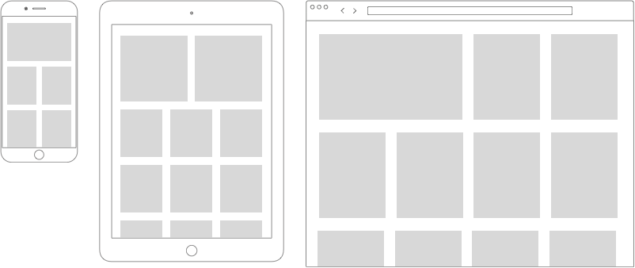

# Drones Website

In this project you'll be building on an existing project. It's your job to make it `responsive` and look organised on various devices.

The HTML and images are in this folder. You are going to write the CSS for this page, **it is not allowed to change the HTML**.

The page contains two grids: the first one should work using `flexbox`, the second using `grid`. Be careful not to mix the two!

Other than that you should use `media queries`. Here are the requirements for each device size:

- On mobile phones (smaller than 600px): a one column grid, that spans the full width
- On tablets (between 600px and 1024px): a three column grid, with the exception that the first two items span the full width together (so first we have two columns, then after the first two items we have three columns)
- On desktops (1024px and up): a four column grid, with the exception that the first item spans two columns.
- There should be some `margin` between the grid items

So that it works like this:

## Things to think about

- Which way do you think is better for this use case? Flex or grid? What use cases can you think of that would make you use the other one?
- Can every browser run both flex and grid? What about certain features of flex and grid? What is an easy way to see if browsers support a certain feature?
- Did you use the browser inspector for the exercise? What is the reason for yes/no here?
