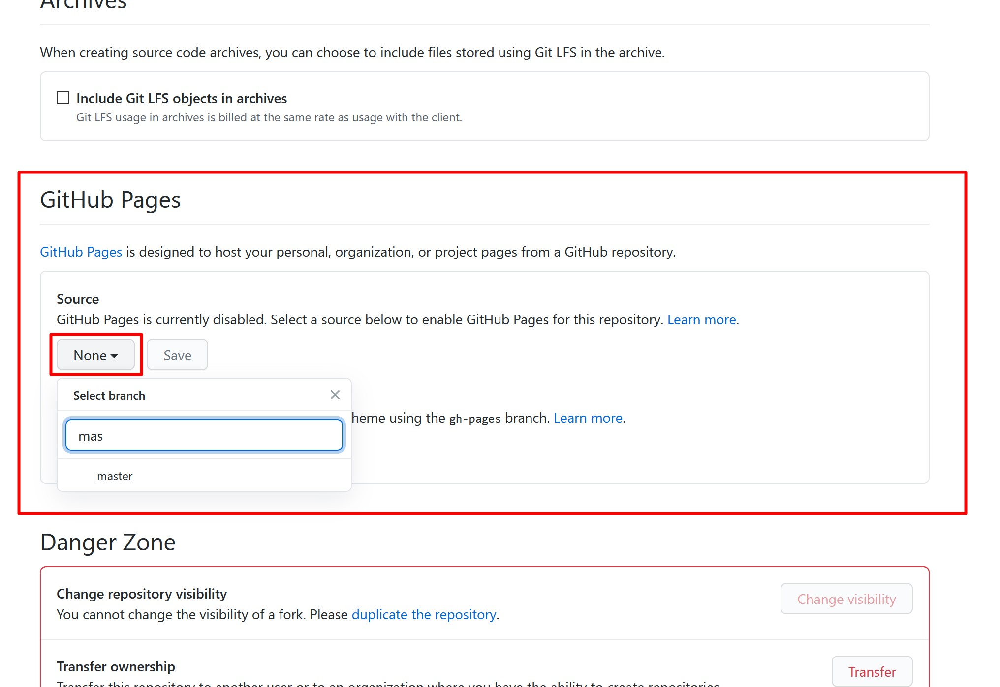

# How to hand in homework

During this module you will hand in your homework in the following order:

1. [GitHub](https://www.github.com/HackYourFuture/HTML-CSS).

You'll first create a personal GitHub repository (a storage place for code) in which you'll upload all the homework files.

2. [Trello](https://trello.com/b/U1gK8Q1c/feedback-assignments).

After you've uploaded your files you'll copy the link to the homework folder in GitHub and paste it in a card on Trello in the board "Feedback Assignments" (in the correct week).

In the following guides you'll learn how to do this step-by-step.

## 1. GitHub homework guide

At the beginning of the module:

1. Go to Github and [create a new repository](https://github.com/new) called `HYF-Module-HTMLCSSGIT` (select the option: initialize with README)

Then follow these steps for every week of the HTML/CSS/GIT module:

2. Inside the new repository create a folder with the name of the appropriate week (ex. `week1`)
3. Upload the the homework files
4. Before submitting the upload, write a message that says something about what you've done. For week1 the message could be: "wrote cli commands and build digital resume"
5. Open the files in your folder to check if all of this worked.
6. Now go to the settings of your repository:

7. And go to _Github Pages_ select "main" or "master" instead of "none"

8. Now you can view your homework online at: https://_hereyouplaceyourgithubusername_.github.io/HYF-Module-HTMLCSSGIT/week1, this url will also be visible on the settings page:

> Here is an example of how your homework repository should look: https://github.com/mkruijt/HTML-CSS

## 2. Trello homework guide

Follow these steps to upload the link to your homework:

1. Go to the `Feedback Assignments` board
2. In the correct week, create a card with your name and week number (like, `Noer Paanakker Week 1 homework`)
3. Click on the card, and attach the URL of your GitHub repository and/or other links that are relevant. Additionally, add a short description of what you did

If you have any questions or if something is not entirely clear ¯\\\_(ツ)\_/¯, please ask/comment on Slack!
